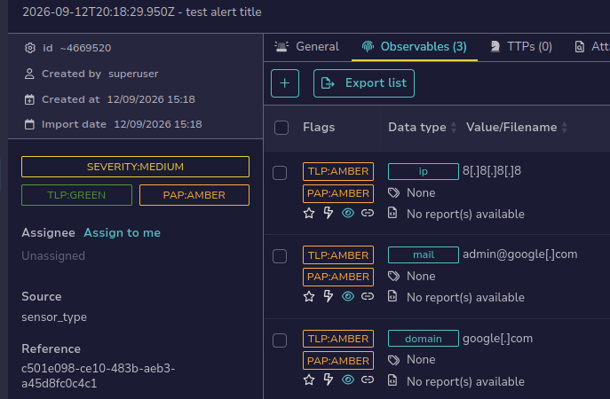
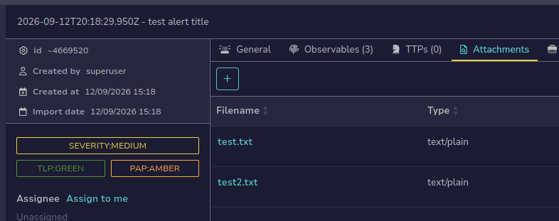
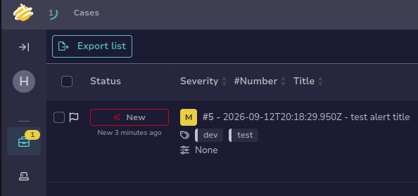
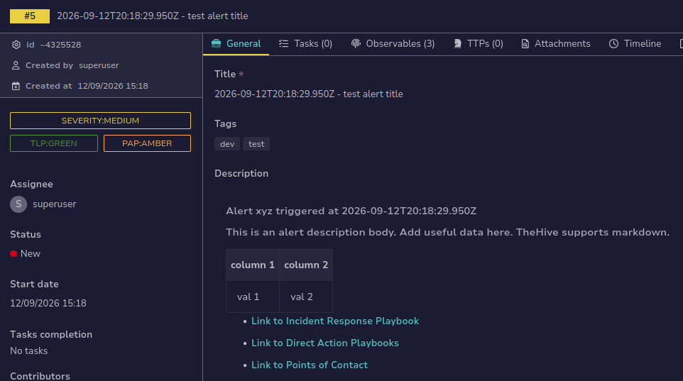
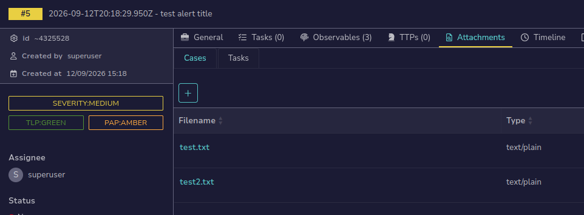

# TheHive API Examples
`send-alert.py` and `case-actions.py` demonstrate:
- creating alerts in TheHive
- attaching files to alerts
- promoting alerts to cases
- adding files to cases
- downloading case files

These scripts require you to have:
- TheHive5 running
- An organisation (note "s" not "z") named `homelab`
- A user (that isn't the default admin) with an API key.
- create a `.env` file containing `hive_api` and `hive_url`

*This process, using the Docker version, takes ~3 minutes or less to get configured.*

[Installation Methods](https://docs.strangebee.com/thehive/installation/installation-methods/)

[API Docs](https://docs.strangebee.com/thehive/api-docs/)

[thehive4py Python Docs](https://thehive-project.github.io/TheHive4py/latest/reference/client/)

### `uv run send-alert.py`

new alert with `imported` status (promoted to case)

alert observables

alert attachments

### `uv run case-actions.py`

**hardcode the demo case ID and case number at the top of the script**

the new case

case description body

case file attachments

