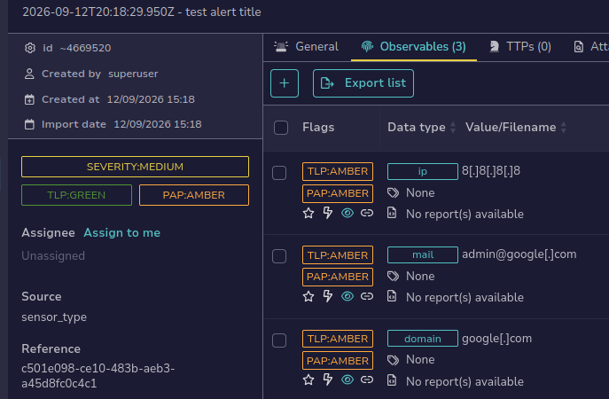
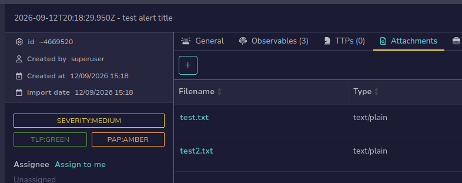
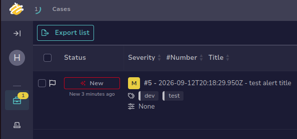
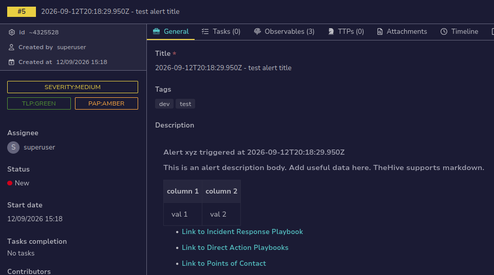
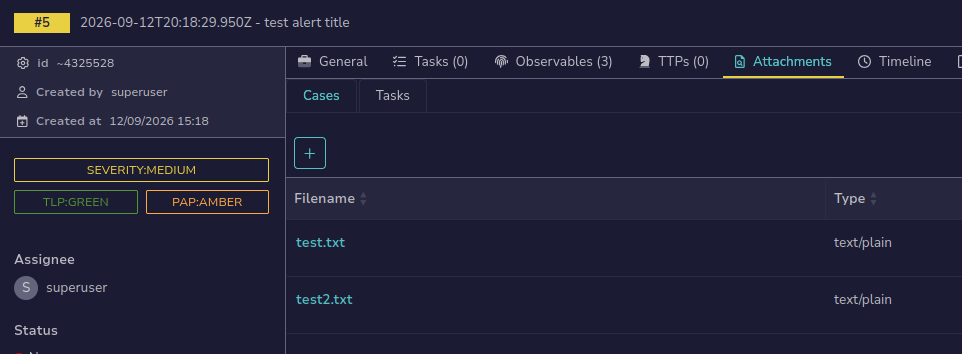
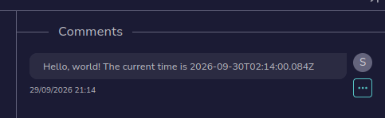
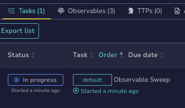
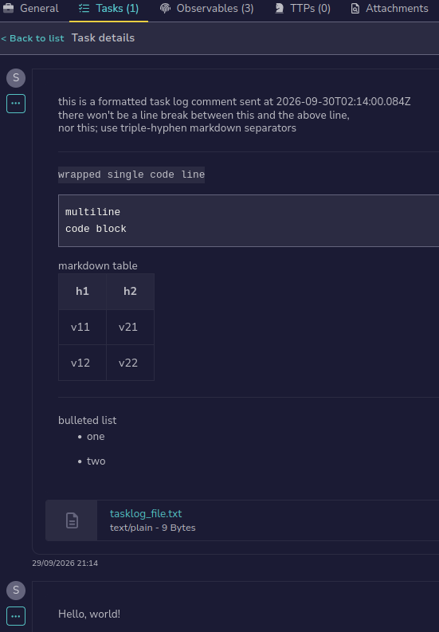

# TheHive API Examples

`send-alert.py`
- send an alert with observables
- attach files to that alert

`send-alert-promote-to-case.py`
- send an alert with observables
- attach files to that alert
- promote the alert to a case

`case-actions.py`
- get case ID and number
- add observables to a case using multiple methods
- get case observables
- upload and download case attachments

`merge-alerts-into-case.py`
- use filters to locate relevant alerts by status, time, observable
- merge alerts into a case

`find-alerts-cases-observables.py`
- use filters to locate relevant alerts and cases by status, time, observable
- find alerts with desired observables
- find cases with desired observables

`case-and-tasklog-comments.py`
- add case comments
- create a new task, if it doesn't exist already
- add tasklog comments to the new task
- attach files to the tasklog comment

`add-observables-to-case.py`
- add observables from a list or file to a given case

`tasklog-file-upload-only.py`
- upload one or more files to a case task log, with an optional message

---

These scripts require you to have:
- TheHive5 running
- An organisation (note "s" not "z") named `homelab`
- A user (that isn't the default admin) with an API key
- create a `.env` file containing `hive_api` and `hive_url`
- TODO: add Docker quickstart notes

*This process, using the Docker version, takes ~3 minutes or less to get configured.*

[Installation Methods](https://docs.strangebee.com/thehive/installation/installation-methods/)

[API Docs](https://docs.strangebee.com/thehive/api-docs/)

[thehive4py Python Docs](https://thehive-project.github.io/TheHive4py/latest/reference/client/)

[thehive4py Offical Examples](https://github.com/TheHive-Project/TheHive4py/tree/main/examples)

---

### Anywhere you use [case_id](https://thehive-project.github.io/TheHive4py/latest/reference/endpoints/#thehive4py.endpoints.case.CaseId) you may use the case ID, such as "~1234" (with tilde), or the number displayed in the web view, such as "42" (as a string).
```
hive.case.get(case_id="~1234")
hive.case.get(case_id="42")
```

---

### `uv run send-alert-promote-to-case.py`
- or run `send-alert.py` to generate test alerts, without promoting them to a case

new alert with `imported` status (promoted to case)


alert observables



alert attachments



### `uv run case-actions.py`

**hardcode the demo case ID and case number at the top of the script**

the new case



case description body



case file attachments



### `uv run case-and-tasklog-comments.py -c <id|number>`

case comment



new task



task tasklogs (comments) with markdown and file attachment


